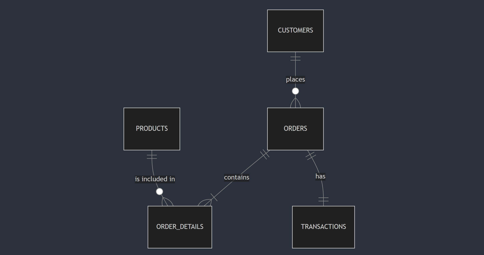

# Design Document

By Gleb Eliseev

Video overview: <(https://www.youtube.com/watch?v=lOaVuT4s3d4)>

## Scope

For my project i have decided to use MySql, instead of Sqlite3, below is the general information

* Database represent a sample of what could be used by a company selling electronic products.
* Database includes customers information and demographics, alongside all of the relevant order and product details.
* Database could be further improved by adding the following information: Current stock level of the producst, discount information, suppliers information.

## Functional Requirements

* Users are able to:
  1) Explore sales trends and seasonalities
  2) Analyze purchasing patterns and history for any given customer
  3) Review status of orders and what products are included
  4) Analyze product performance, by finding the top selling products within given Segments
  5) Update and process Customer information
  6) Generate sales reports

* Users are not able to:
  1) Manage Sales representatives, and understand who performs best within the sales team
  2) Manage stock of the product
  3) Analyze sales team performance

## Representation

### Entities

* **Database represent the following entities**:

  1) **Customers**: Including all of the relevant information about customer
  2) **Products**: Representing all of the available items we are selling
  3) **Orders** Representing orders place by customers
  4) **Order Details**: Representing additional information related to orders such as what products are included
  5) **Transactions**: Representing financial information about each order placed
  6) **customers_deleted**: table which is not connected to the rest of the DB, to store information about deleted customers.

* **Entities are defined by the following attributs**:

  1) *Customers* Table
     - **customer_id**: Primary Key, and a unique identifier for each customer
     - **customer_segment**: Which segemnt customer is in - 3 options are available (New, Occasional and Loyal).
     - **customer_name**: Name of the customer
     - **email**: Email address of the customer
     - **phone**: Phone number of the customer
     - **country**: Country where customer is located
     - **city**: City where customer is located
     - **date_created**: Date when customer was added to the system

     *Product* Table
     - **product_id**: Primary Key, and a unique identifier for each product/SKU
     - **product_name**: Name of the product, eg Samsung Galaxy fold
     - **price**: Price of the product
     - **category**: Which category product is in - 4 options are available (Tablets, Computers, Phone and accessories).

     *Orders* Table
     - **order_id**: Primary Key, and a unique identifier for each order
     - **customer_id**: Reference to a customer
     - **order_date**: Date when order was placed
     - **delivery_date**: Expected date of order delivery
     - **order_status**: Status of the order - 3 options are available (Pending, Shipped, Delivered).

     *Order Details* Table
     - **order_id**: Primary Key, and a unique identifier for each order detail
     - **product_id**: Reference to a product table
     - **quantity**: Number of units sold
     - **purchase_price** Price at which 1 unit is sold

     *Transactions* Table
     - **transacion_id**: Primary Key, and a unique identifier for each transaction
     - **order_id**: Reference to a order
     - **transaction_date**: Date when payment occured
     - **transaction_amount**: Total payment amount

* **Data types chosen**

    I was generally trying to keep it simple, and make sure that I am following best practices for MySQL, below is the list of data types used, and the reasoning.

    - **INT**: Is used for Primary and Foreign keys across all of the tables.
    - **VARCHAR**: Is used for text fields, with defined maximum length, like email, customer name and others. I opted for VARCHAR over TEXT due to performance optimization, and best practices of MySql
    - **ENUM**: Is used for text fields, where only certain input is expected, like customer segment.
    - **DECIMAL**: Is used for monetary values, like transaction amoutn, or price.
    - **DATEIME**: Is used ot time values, like order date or transaction date.

* **Applicable constrains**

    I have used several common constrain on my columns, to ensure basic data integrity.

    - **DEFAULT**: Is used in cases where default value can be added to automate the update process, such as automatically asigning
      customer segment as new.
    - **ENUM**: Can also be considered a constrain, which is used to make sure i have data integrity in certain columns.
    - **UNIQUE**: Is applied for columns where only uniques values are expected in the columns of the Dimensional tables.

    Trigger constrain

    - On Delete, customers are being moved to a table of "deleted customer" - this helps us to reach back to the customer that we no longer want to keep in our DB at the moment.

### Relationships

*   **Relationships overview**

    - CUSTOMERS to ORDERS: One customer can place multiple orders
    - ORDERS to ORDER_DETAILS: Each order contains multiple products (order details)
    - PRODUCTS to ORDER_DETAILS: Each product can appear in multiple orders
    - ORDERS to TRANSACTIONS: Each order is paid for by one transaction

*   **Entity Diagram**

## Optimizations

*   I have created several optimizations to improve performance and maintainability:

    - **ndexes:** Added indexes on commonly queried fields like customer_id, product_name, and order_id to enhance query performance during searches and joins
    - **Views:** Developed views like customer_order_history and top_10_phones to simplify complex queries, allowing to quickly access summarized information for reporting purposes
    - **Procedure:** Implemented a procedure update_customer_segments to automate customers classification based on their order history, improving data accuracy and efficiency
    - **Trigger:** Created a trigger before_customer_delete to enforce soft deletion, ensuring deleted customers are archived in customers_deleted table, maintaining data history for future reference

## Limitations

* **Design Limitations**

    - **Stock and Supplier Data:** The DB does not track product inventory or supplier details, limiting its ability to manage the stock levels
    - **Discount and Promotion Management:** No functionality to manage discounts or promotions, eg assigning them to orders for Loyal customers - making it difficult to adjust pricing dynamically
    - **Sales Rep Tracking:** The system does not track sales reps performance, preventing analysis of team effectiveness or assigning orders to specific reps
    - **Orders/Transactions Complexity:** The design only handles basic orders and transactions, without support for partial shipments, split payments, or more complex sales scenarios

* **What could be represented better**

    - **Order Status Tracking:** The DB tracks basic order statuses (Pending, Shipped, Delivered) but lacks detailed tracking like shipment stages or delivery progress
    - **Customer Feedback:** There’s no functionality to capture customer reviews or feedback on products, limiting insight into customer satisfaction and product improvements
    - **Payment Method Tracking:** The system doesn’t track different payment methods (e.g., credit card, PayPal), making it harder to analyze payment preferences
    - **Returns and Refunds:** No support for managing product returns or issuing refunds, which could be essential for handling complaints or defective products
